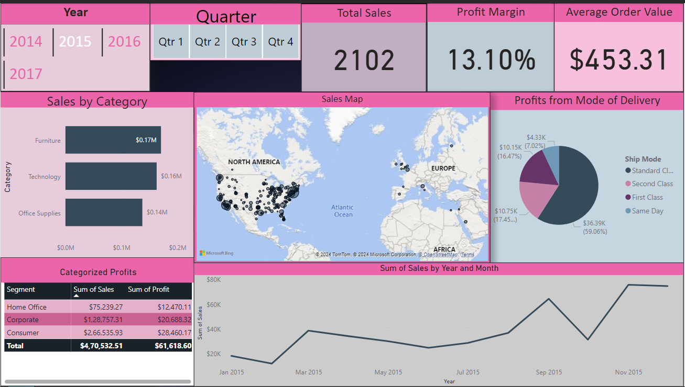

# Costco Wholesale Corporation: A Data-Driven Approach to Supply Chain Operations 🏬📊

## Table of Contents 📚
1. [Information on Open-Source Data ℹ️](#Information-on-Open-Source-Data-ℹ️)
2. [Purpose and Goals 🛠️](#purpose-and-goals-️)
3. [Key Questions for Data Analysis 🤔](#key-questions-for-data-analysis-)
4. [Metrics and KPIs 📈](#metrics-and-kpis-)
5. [Data Model 🗂️](#data-model-)
6. [Results 🏅](#results- )
7. [Dashboard Screenshots 🖼️](#Dashboard-Screenshots-)
8. [Conclusion 🎯](#conclusion-)
9. [Link to Presentation 📑](#link-to-presentation-)

---
## Information on Open-Source Data ℹ️

For this project, we used **open-source data** from **Kaggle**, a platform for data enthusiasts to share and work with real-world datasets. Specifically, we worked with a **Supply Chain Dataset for Retail Businesses**, which contained the following information:

- **Product Categories**: Technology, Furniture, Office Supplies
- **Order Details**: Order ID, Order Date, Shipping Date, Shipping Mode
- **Customer Details**: Customer ID, Name
- **Sales Metrics**: Sales, Quantity, Discounts, and Profit

The dataset was chosen because it closely resembles the kind of data Costco would deal with on a daily basis.

---

## Purpose and Goals 🛠️
At **Costco Wholesale Corporation**, maintaining operational efficiency, customer satisfaction, and profitability is crucial to sustaining their global retail leadership. The purpose of this project is to create a comprehensive **executive dashboard** that offers a **visual and data-driven analysis** of Costco's supply chain operations.

The key goals of this dashboard are:
- Facilitate **informed decision-making** by visualizing essential supply chain metrics.
- Provide clear insights into critical areas such as **sales**, **shipping**, **customer segmentation**, and **profitability**.

This will allow Costco to track operational performance in real time, enhancing decision-making efficiency and supporting strategic goals.

---

## Key Questions for Data Analysis 🤔
To ensure that the dashboard provides valuable insights, we focused on the following key questions:
1. **What is the total sales volume, and how does it compare across different product categories?**
2. **How do different shipping methods affect profitability?**
3. **Which customer segments contribute the most to overall sales and profitability?**

---

## Metrics and KPIs 📈
Tracking the right metrics is critical for both operational and strategic decision-making. Below are the **Key Performance Indicators (KPIs)** we have defined:

- **Total Sales**: This metric tracks overall revenue and is key for evaluating the company's market performance.
- **Average Order Value (AOV)**: A measure of how much customers are spending per order, helping to gauge customer behavior and spending trends.
- **Profit Margin**: Shows the overall profitability by calculating the ratio of profit to total sales.
- **Sales by Category**: Analyzes which product categories (e.g., technology, furniture, office supplies) contribute the most to sales.
- **Sales by Mode of Delivery**: Compares the profitability and cost efficiency of different shipping methods (e.g., standard, express).

---

## Data Model 🗂️
Our data model was built using **Kaggle's Retail Dataset**, which includes a variety of important fields such as order details, shipping information, and customer data. These fields were combined to track **sales, shipping methods, and customer segmentation**.

The primary data fields used include:
- **Order ID, Order Date, Ship Mode**
- **Customer ID, Customer Name**
- **Product Category, Sales, Quantity, Discount, Profit**

---

## Results 🏅
The executive dashboard generated valuable insights into Costco's operations. Some of the key findings include:
- **High-demand product categories** like office supplies drove significant sales volume, but **technology** products had the highest profit margin.
- Shipping by **express mode** increased customer satisfaction but came at a higher cost, affecting the overall profit margin for certain categories.
- The **corporate customer segment** generated the highest revenue, while the **home office segment** had a higher average order value, showing strong spending potential.
  
---

## 🖼️ Dashboard Screenshots

### 1. Overall Dashboard View

### 2. Sales Trends and Categories Overview

### 3. Profits by Category

### 4. Profits by Shipping Mode

### 5. Sales Distribution Map

---

## Conclusion 🎯
The dashboard successfully provides Costco with a **holistic view of their supply chain operations**, including essential insights into sales, customer behavior, and shipping efficiency. With this information, Costco stakeholders can make **informed strategic decisions** that focus on increasing profitability, improving customer satisfaction, and streamlining their supply chain operations.

This **data-driven approach** allows Costco to maintain its competitive edge in the retail industry by offering **timely, actionable insights** into key operational areas.

---

## Link to Presentation 📑
The presentation for this project is available [here]([./ppt/presentation.pptx](https://github.com/luckypatel370/shop-dashboard/blob/main/GROUP7_ASSIGNMENT_FINAL.pdf).
