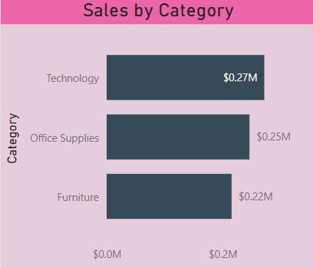

# Costco Wholesale Corporation Supply Chain Dashboard 📊

## 1. Information on Open-Source Data

For this project, we used **open-source data** from **Kaggle**, a platform for data enthusiasts to share and work with real-world datasets. Specifically, we worked with a **Supply Chain Dataset for Retail Businesses**, which contained the following information:

- **Product Categories**: Technology, Furniture, Office Supplies
- **Order Details**: Order ID, Order Date, Shipping Date, Shipping Mode
- **Customer Details**: Customer ID, Name
- **Sales Metrics**: Sales, Quantity, Discounts, and Profit

The dataset was chosen because it closely resembles the kind of data Costco would deal with on a daily basis.

---

## 2. Purpose and Goals 🎯

Our primary purpose was to create a dashboard that helps **Costco Wholesale Corporation** better understand its supply chain operations. This dashboard serves as a **data-driven decision-making tool** to achieve the following goals:

- 📦 **Visualize key metrics** like sales, shipping, and profitability.
- 🔍 **Track operational performance** for better resource allocation.
- 📊 **Simplify decision-making** by presenting complex data in an easy-to-digest format.

---

## 3. Key Questions on the Data ❓

To guide the analysis, we focused on three main questions:

1. **What are the total sales and profit trends across different product categories?**
2. **How does the mode of delivery affect profitability and shipping efficiency?**
3. **Which customer segments generate the most revenue, and how do they prefer to receive their products?**

These questions were designed to address Costco’s operational efficiency, profitability, and customer satisfaction.

---

## 4. Metrics and KPIs 📊

We defined several metrics and **Key Performance Indicators (KPIs)** to track Costco’s operational and strategic objectives:

- **Total Sales**: This helps assess overall revenue generation.
- **Average Order Value (AOV)**: Calculated by dividing total sales by the number of orders to understand customer spending behavior.
- **Profit Margin**: This shows the company’s profitability by analyzing total profit relative to sales.
- **Sales by Category**: Helps identify high-demand products by showing a breakdown of sales by product category.
- **Sales by Mode of Delivery**: Displays the impact of different shipping methods on costs and profitability.

These KPIs give a clear picture of Costco’s performance and allow the company to adjust its strategy accordingly.

---

## 5. Data Model 🏗️

Our **data model** was structured around the key entities in Costco’s supply chain operations:

- **Customers**: Representing Costco members, including customer ID and details.
- **Orders**: Containing information like Order ID, Order Date, and Shipping Mode.
- **Products**: Representing product categories such as Technology, Furniture, and Office Supplies.
- **Sales Metrics**: Including Sales, Profit, and Discounts.

This model enabled us to effectively track relationships between **customer segments**, **product sales**, and **delivery modes**.

---

## 🖼️ Dashboard Screenshots

Below are some key visuals from the **Costco Supply Chain Dashboard**.

## 🖼️ Dashboard Screenshots

### 1. Overall Dashboard View

### 2. Sales Trends and Categories Overview

### 3. Profits by Category

### 4. Profits by Shipping Mode

### 5. Sales Distribution Map

The **Sum of Sales by Year and Month** line chart shows Costco's sales trends over time, allowing for analysis of seasonality and market fluctuations.

---
## 6. Results 🎉

By visualizing the data through our dashboard, we uncovered several important insights:

- **Sales Trends**: Technology products had the highest sales, but office supplies generated the highest profit margins.
- **Shipping Efficiency**: Express shipping was the most expensive but had the lowest impact on profit margins, suggesting that customers prefer faster delivery even if it costs more.
- **Customer Segmentation**: High-value customers contributed significantly to Costco’s revenue, especially in the furniture and technology categories.

These insights highlight areas where Costco can optimize its operations to enhance profitability.

---

## 7. Conclusions ✨

The dashboard successfully provided a **holistic view** of Costco’s supply chain, allowing the company to:

- Make **informed decisions** based on key metrics like sales, profit, and customer segmentation.
- Identify areas where **operational efficiency** can be improved, such as in shipping and delivery modes.
- Understand which **product categories** and **customer segments** drive the most value, helping Costco focus its marketing and resource efforts effectively.

In summary, this project illustrates the power of **data-driven decision-making** in improving Costco’s supply chain operations.

---

**GitHub Repository**: [View the full project here](link_to_github_repo).
